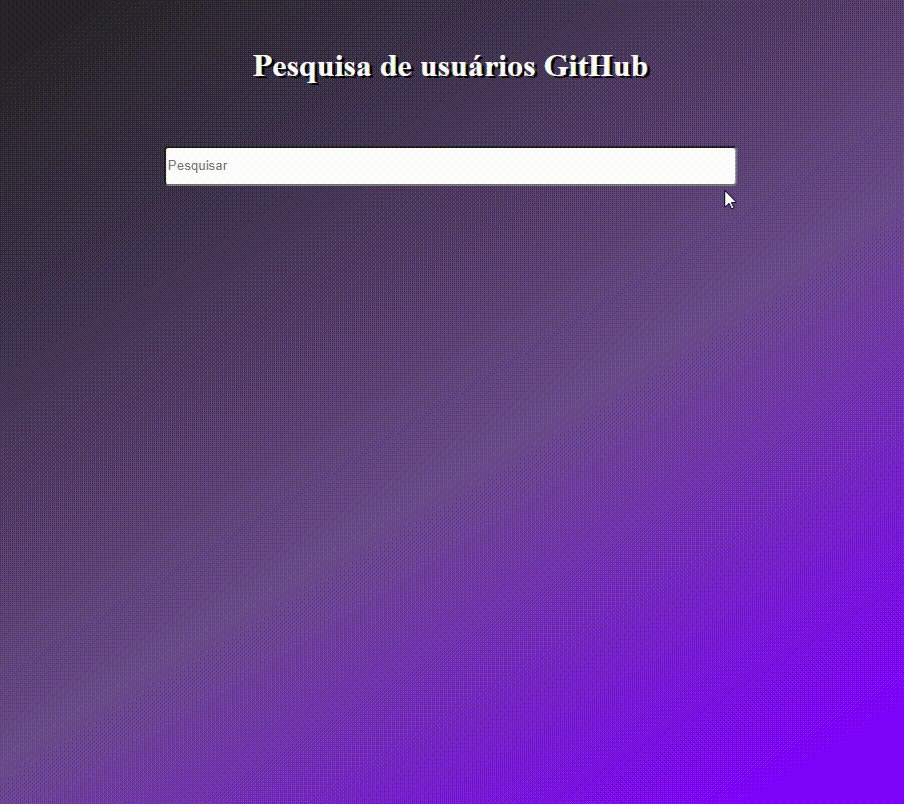

<h1>Aplicação React GitHub APP</h1>

  Aplicação que consome a API do GitHub para buscar usuários, seus repositórios
  e favoritos. Criada utilizando Class Component e PropTypes.

<h2>Para executar o código siga os seguintes procedimentos:</h2>

-> No seu terminal navegue até a pasta "appgithub"

-> Rode no terminal o comando "yarn" ou "npm install"

-> Após baixar todos os pacotes, rode "npm start" ou "yarn start"

No seu navegador acesse "http://localhost:3000/" para rodar a aplicação

  Obs: é necessário ter o <a href="https://nodejs.org/en/">NodeJS</a> instalado!

